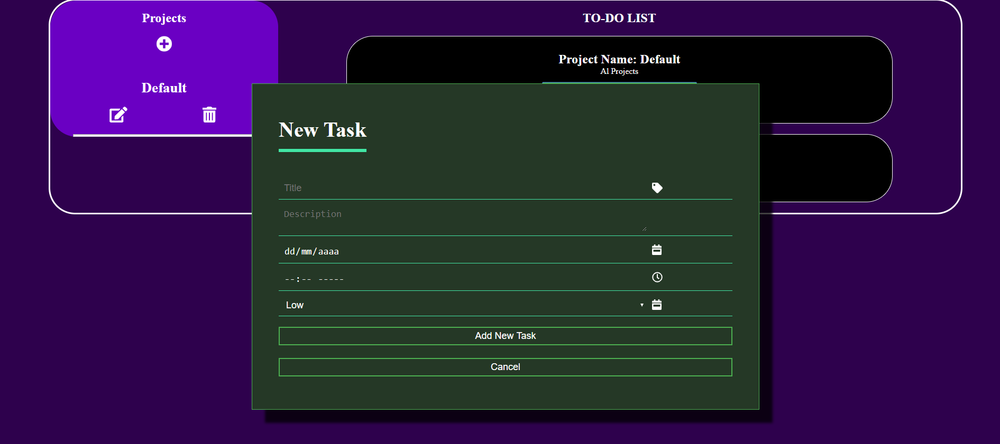

<h1 align="center">:page_with_curl: TODO LIST PROJECT</h1>

  

# :globe_with_meridians: [Live Version](https://raw.githack.com/jucora/TODO-LIST/master/dist/index.html):point_left:

## :pencil: Description

This project consists of creating a task application. The user can create or delete projects, and in turn create tasks that belong to a specific project.

The application contains a date validation so that the user can only create events that do not have past dates.

This project belongs to the Microverse curriculum in the Javascript section.

## :earth_americas: Live Version here:

## :heavy_check_mark: Odin Projet Link

[TODO LIST Project](https://www.theodinproject.com/courses/javascript/lessons/todo-list)

## :point_right: Functionalities

- User can create projects
- User can edit Projects
- User can remove projects
- User can create tasks for a project
- User can edit tasks for a project
- User can remove tasks for a project

## :arrow_right: Instructions to use the TODO-LIST locally

- You can clone the repo by running the next command in your command line: 
  
<code>git clone https://github.com/jucora/TODO-LIST.git</code>

- Next, follow the route: TODO-LIST/dist

- You'll find the index.html file, open it and you're good to go!

## :computer: Languages and Tools

- HTML
- CSS
- Javascript
- Webpack

## Author

:man: Julian Belmonte

- Github: [@jucora](https://github.com/jucora)
- Twitter: [@Julian Belmonte](twitter.com/JulianBelmonte)
- Linkedin: [Julian Belmonte](linkedin.com/in/julianbel)
